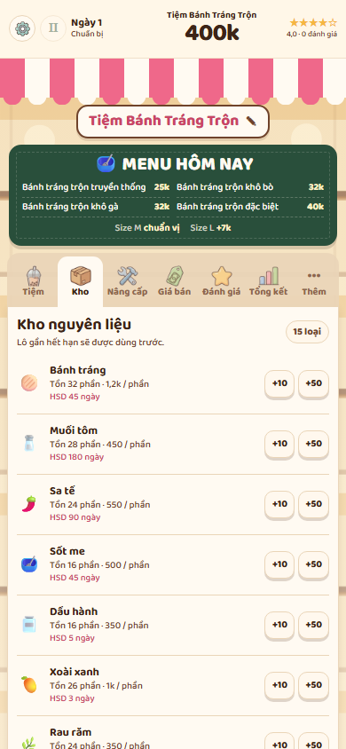
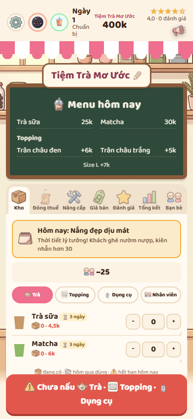

# Visual comparison: current project and reference

## Capture setup

- Captured the live current project and reference in headless Chrome at a 390 × 844 CSS-pixel viewport.
- Entered the game on both pages and selected **Kho** on the current project, so the main content and navigation could be compared at the same route.
- Both pages reported a 390px document width with no horizontal overflow.
- Before screenshots: [current project — Kho](visual-audit/before/current-kho-390x844.png) · [reference — Kho](visual-audit/before/reference-kho-390x844.png). Entry screens: [current](visual-audit/before/current-390x844.png) · [reference](visual-audit/before/reference-390x844.png).

## Component comparison

| Component | Current project | Reference | Difference | Required fix |
|---|---|---|---|---|
| App width | 390px at this viewport; `.app-shell` has a 560px max width. | 390px at this viewport; `.app` is capped at 560px. | Mobile width matches. Desktop still needs an explicit 560px check. | Keep a 560px cap and verify centered desktop rendering. |
| Header | 66px high, three-column grid; title, money and rating fit on one row. | 82.6px high in this capture; the day/status block wraps to three lines. | Reference header is 16.6px taller and its left column wraps. | Keep the three-column grid, constrain header text and controls so the header stays compact without wrapping. |
| Awning | 44px base height plus 10px scallops (about 54px visual height). | 26px base height plus 10px scallops (about 36px visual height). | Current awning is about 18px taller. | Set the awning to 26px and retain 10px alternating scallops. |
| Shop sign | 218 × 38px at x=86; ends 7px before the board starts. | 221 × 51px at x=85; overlaps the board by about 10px. | Current sign is shorter and separated from the board. | Use the reference border, padding and negative lower margin so the sign overlaps the board. |
| Menu board | 370 × 114px at y=163; 5px frame, 10px horizontal padding and 10.9px menu rows. | 366 × 193px at y=168; 8px frame, 14px horizontal padding and larger menu rows. | Current board is 79px shorter and its menu text is much denser/smaller. | Match the compact two-column item list, 8px frame, specified padding and roughly 1.35rem title / .92rem rows. |
| Main tabs | 374 × 61px at y=285; six primary tabs plus **Thêm**; icons are 24px. | 366 × 60px at y=371; seven tabs including **Bạn bè**; icons are about 30px. | Height is close, but current has a different route count and smaller icons. | Match transparent flex tabs and 30px icons. Keep the current extra game routes under **Thêm**; the project has no friends route or friend data model. |
| Content pane | Starts at y=346, width 374px; inventory pane is content-sized (1085px for all inventory rows). | Starts at y=431, width 366px; visible pane is 340px in this capture. | Both panes connect to the active tab and neither has a forced tall minimum; pane height depends on route content. | Keep the pane content-sized, set 12px side margins/padding and reserve space for a fixed bottom action. |
| Ingredient rows | 68px tall; 28px icon, 6px gap; separator rows rather than cards. | First visible row is 55.4px tall; 30px icon, 10px gap; separator rows rather than cards. | Current rows are about 13px taller and slightly tighter horizontally. | Use a 30px icon column, 10px gap and 8px vertical padding; retain the existing state-driven row content. |
| Buttons | Small stock buttons are 34 × 31px, 1px border and visible raised shadow. | Small stock controls are visually compact; the reference spec calls for 2px borders and 4px × 8px padding. | Current controls read heavier and taller than the reference. | Normalize small controls to the specified border, padding, radius and text size; keep the larger pink style for primary actions. |
| Bottom action | No fixed action bar appears on the current Kho screen; the dashboard’s **Mở bán** action sits in its content. | Red **Chưa nấu** action appears at the viewport bottom, 366 × 80px in this capture. | Current lacks the persistent bottom action; the captured reference action is also taller than the requested compact 420px-capped button. | Add a fixed gradient wrapper and use the existing **Mở bán** action/state without adding cooking mechanics. Cap the button at 420px. |
| Background visibility | Repeating shelf/jar SVG is visible, but it is pale and simple; the tall inventory pane covers the center. | Illustrated shop shelves are visible around/behind the UI. | Current backdrop has less detail and contrast. | Keep a code-native asset and make it a fixed, centered, cover background behind the sign, board, tabs and pane. |
| Font size | Baloo 2; menu rows are 10.9px at this viewport, tab labels 10.9px. | Baloo 2; menu rows and labels appear larger, matching the requested .92rem board text and .7rem tabs. | Current chalk menu rows are visibly undersized. | Use Baloo 2 consistently; increase board row text and use the specified tab label size. |
| Vertical spacing | Board ends at y=277 and tabs start at y=285 (8px gap). | Board ends at y=361 and tabs start at y=371 (10px gap). | The board-to-tabs gap is already close; most of the 86px tab offset comes from the shorter current sign/board composition. | Preserve the small board-to-tabs gap; correct the sign and board proportions rather than inserting empty space. |
| Friends | No friends route, view, state, or friend actions exist in the current project; secondary routes are employees and two minigames. | Includes a **Bạn bè** tab and a compact friend-card screen. | This is a product/data gap, not a CSS difference. | Do not fabricate friend records or actions in a presentation-only pass. Keep the available routes accessible; a real friends pane needs existing friend data or a separate feature decision. |

## Before screenshots

### Current project — Kho

### Reference — Kho

## After rework — 2026-09-29

The final screenshots were captured from the current local source with service-worker and browser-cache bypass enabled. The final app keeps the reference's narrow shop composition: a compact three-column header, 26px awning with 10px scallops, overlapping sign and chalkboard, six connected primary tabs, a content-sized pane, and a fixed preparation action. The board is 184px tall versus 193px in the reference capture; the sign is 48px versus 51px; the tab strip is 65px versus 60px. The shop background is a local illustrated SVG, fixed at center-top with `cover`.

At 390 × 844, all captured routes report a 390px document width and no horizontal overflow. The pane uses `min-height: 0`; the review and empty summary panes end after their content. At 1366 × 768, the app is centered at x=403 and is 560px wide. The fixed bottom action is 366px wide on mobile and capped at 420px on desktop.

| Screen | Final screenshot |
|---|---|
| Tiệm | [390 × 844](visual-audit/after/mobile/tien-390x844.png) |
| Kho | [390 × 844](visual-audit/after/mobile/kho-390x844.png) |
| Nâng cấp | [390 × 844](visual-audit/after/mobile/nang-cap-390x844.png) |
| Giá bán | [390 × 844](visual-audit/after/mobile/gia-ban-390x844.png) |
| Đánh giá | [390 × 844](visual-audit/after/mobile/danh-gia-390x844.png) |
| Tổng kết | [390 × 844](visual-audit/after/mobile/tong-ket-390x844.png) |
| Thêm menu | [390 × 844](visual-audit/after/mobile/them-390x844.png) |
| Nhân viên | [390 × 844](visual-audit/after/mobile/nhan-vien-390x844.png) |
| Bầu Cua | [390 × 844](visual-audit/after/mobile/bau-cua-390x844.png) |
| Xì Dách | [390 × 844](visual-audit/after/mobile/xi-dach-390x844.png) |
| Đang bán | [390 × 844](visual-audit/after/mobile/selling-390x844.png) |
| Desktop — chuẩn bị | [1366 × 768](visual-audit/after/desktop-1366x768.png) |
| Desktop — đang bán | [1366 × 768](visual-audit/after/desktop-selling-1366x768.png) |

A 50% overlay of the before-reference **Kho** capture and the final **Kho** capture is available at [comparison-overlay-390x844.png](visual-audit/comparison-overlay-390x844.png). It is useful for checking placement and proportions; the artwork and product content differ.

### Regression checks

- Reached selling mode through the fixed **Mở bán** action; the selling scene fills the mobile viewport, has no preparation tabs, and its scroll height matches its client height (766px).
- Previously completed an order through selection, size choice, adding recipe ingredients, mixing, packing and serving; money, served count and review state updated.
- The price field displays thousands (`32 k`) and saves `32000` internally.
- `formatMoneyCompact` produced the requested examples, including `400000 → 400k`, `4500 → 4,5k`, `1200000 → 1,2tr` and `10000000 → 10tr`. No `toLocaleString`, `Intl.NumberFormat`, currency helper, or numeric `đ` display remains in the app source.
- Final browser capture reported no console errors. `git diff --check` passes.

The reference includes a **Bạn bè** screen, but this project has no friends route, view, state, or actions. The existing secondary routes remain under **Thêm**; the rework does not invent friend data or functionality.

