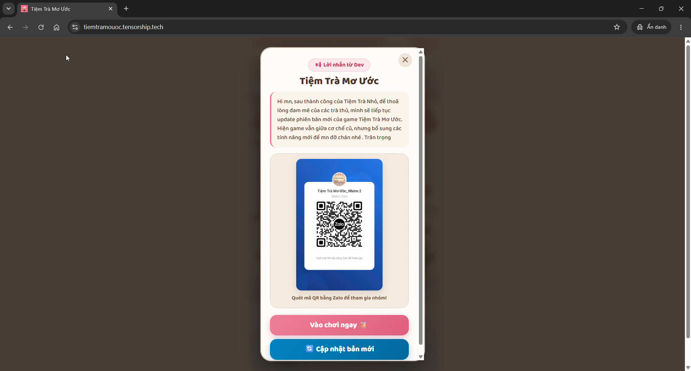
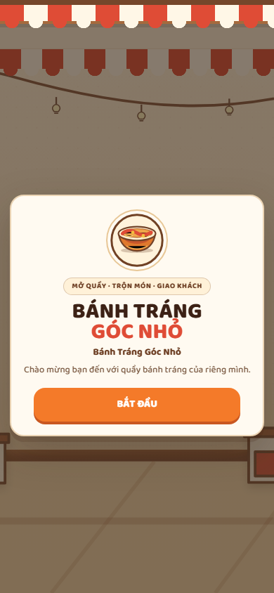
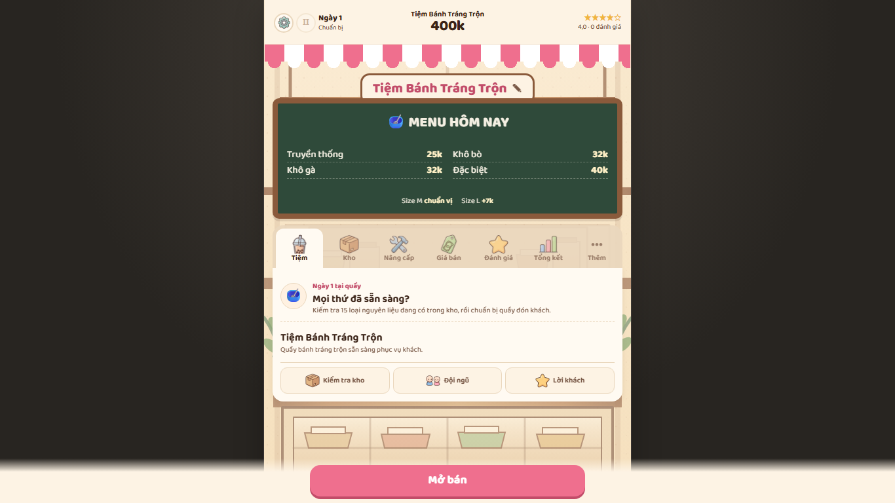
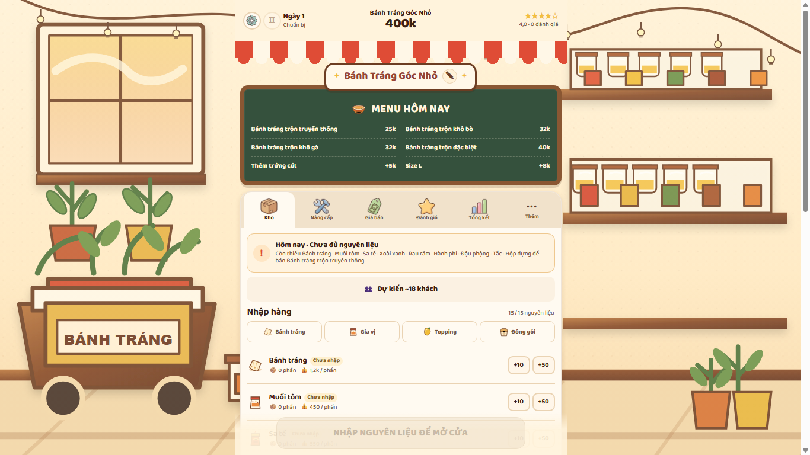
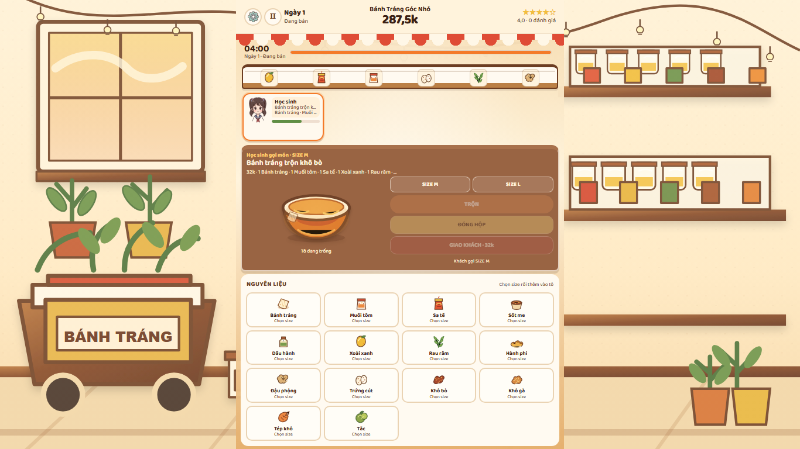

# Visual comparison

## What the recording shows

The provided 53.69-second recording stays on one developer-message dialog for its full length. It shows a dim backdrop, a centered cream panel, a compact heading and copy, a large illustration area, and stacked buttons. It does not show the shop preparation screen or gameplay. The timestamp-by-timestamp review is in [VIDEO_REFERENCE_AUDIT.md](VIDEO_REFERENCE_AUDIT.md).

## Reference dialog and new welcome

The new welcome uses the same broad composition: centered cream panel, dimmed scene, clear heading, illustration and vertically stacked actions. The reference's tea branding and QR/Zalo promotion are not reused.

## Previous desktop and current desktop

The earlier screenshot shows a 560px strip over dark empty gutters. The updated screenshot keeps the game column near 560px and extends the illustrated bánh tráng stall to both viewport edges at 1366 × 768.

The final desktop selling state keeps the same column and shop scene while switching to the customer, order, bowl and ingredient work area.

## Mobile and gameplay captures

- Welcome: [mobile-welcome.png](visual-audit/ui-rework/mobile-welcome.png)
- Tutorial pages 1–2 and replay: [tutorial page 1](visual-audit/ui-rework/mobile-tutorial-01.png), [page 2](visual-audit/ui-rework/mobile-tutorial-02.png), [settings replay](visual-audit/ui-rework/mobile-tutorial-replay.png)
- Preparation gate: [zero stock](visual-audit/ui-rework/mobile-preparation-zero.png), [partial stock](visual-audit/ui-rework/mobile-preparation-partial.png), [ready](visual-audit/ui-rework/mobile-preparation-ready.png)
- Settings and More: [settings sheet](visual-audit/ui-rework/mobile-settings-modal.png), [More navigation](visual-audit/ui-rework/mobile-more.png)
- Selling: [customer order](visual-audit/ui-rework/mobile-selling-order.png), [ingredients in bowl](visual-audit/ui-rework/mobile-selling-bowl.png), [mixing](visual-audit/ui-rework/mobile-selling-mixing.png), [packed](visual-audit/ui-rework/mobile-selling-packed.png), [serve feedback](visual-audit/ui-rework/mobile-selling-feedback.png)
- Save resume and Day 2: [resume screen](visual-audit/ui-rework/mobile-resume-save.png), [Day 2 preparation](visual-audit/ui-rework/mobile-day-two-preparation.png)

## Visual iterations

1. First browser capture compared the complete mobile and desktop composition and walked through stock purchase and serving. It exposed an old notification branch that displayed an error toast after successful ingredient additions, and the work-counter surface needed to read more clearly against its scene.
2. The success/error notification handling and counter color were corrected. The full capture was repeated, including save reload, end-of-day settlement, next-day preparation, More and settings flows. Final metrics show no horizontal overflow at either target width and no browser console errors.

## Limits of the comparison

The recording only supports direct comparison of the welcome/modal composition. Its remaining footage does not show navigation, the shop scene, menu board, preparation, customers or gameplay. Those screens follow the attached bánh tráng requirements and use the existing local game's systems; their appearance is not attributed to unseen video footage.
